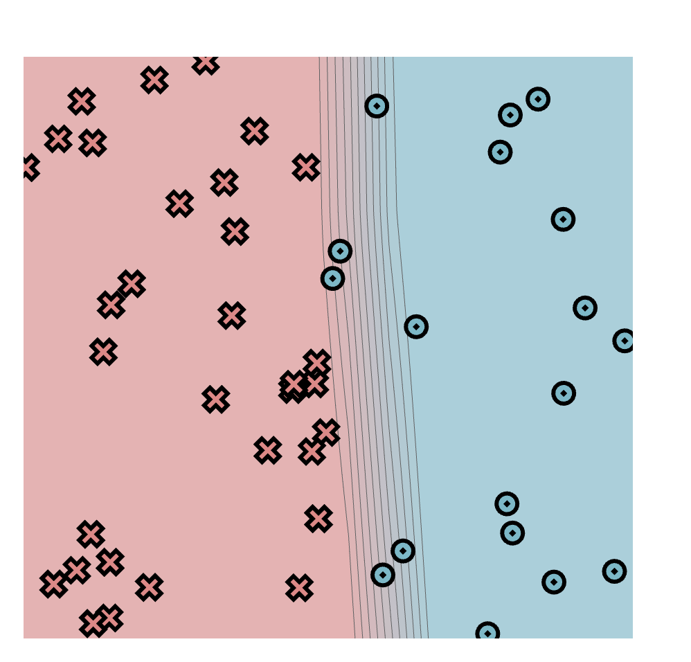
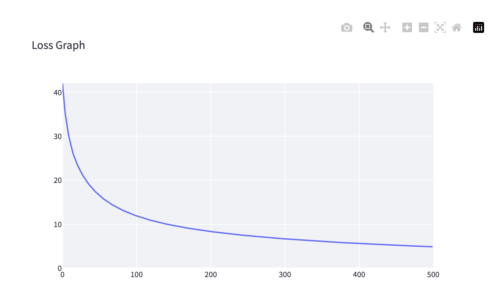
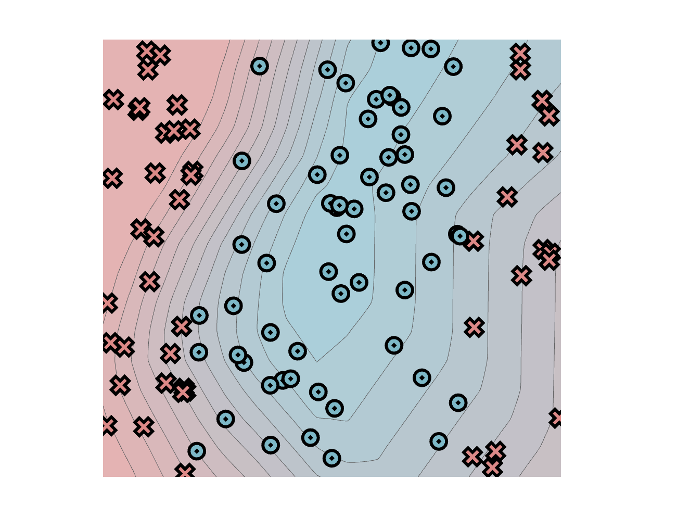
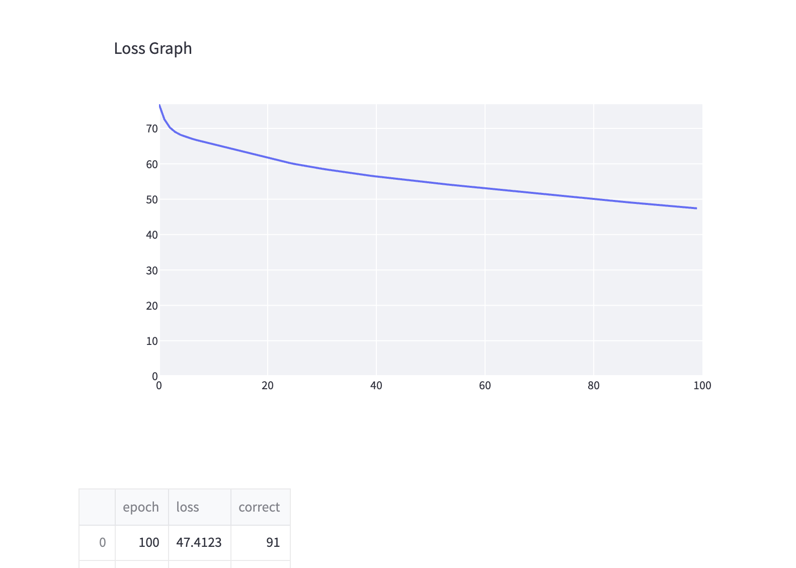
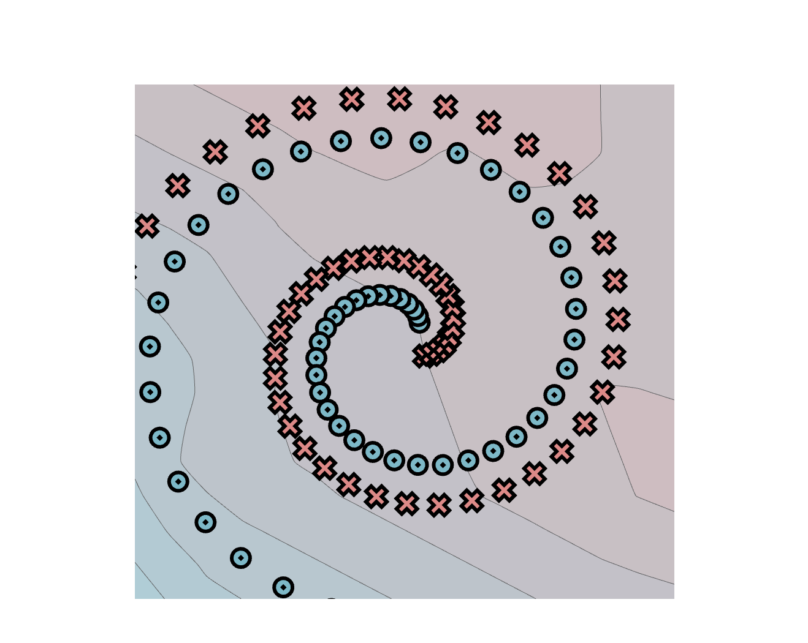
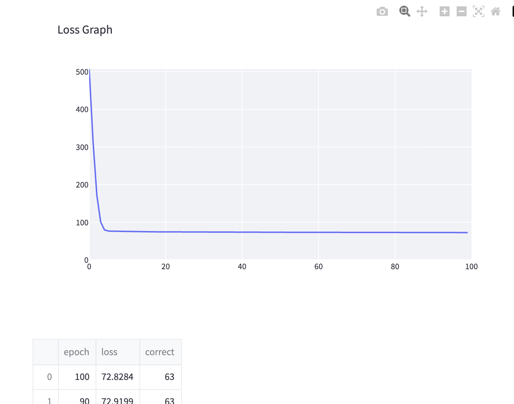

# MiniTorch Module 1

| Датасет | Эпохи | Loss | Верных ответов |
| --- | ---: | ---: | ---: |
| Simple | 500 | ≈ 5 | — |
| Split | 100 | 47.4123 | 91 |
| Spiral | 100 | 72.8284 | 63 |

Значения со скринов. Для Simple точной итоговой таблицы нет.
Simple получился лучше, Spiral пока плохо обучился.

## Simple

## Split

## Spiral

Ещё надо добавить Diag, Xor, параметры запусков и лог обучения.
